MSDS 692 Practicum 1 Final Report
================
John Tamer
2/21/2021

# Forecasting US Border Patrol Encounters Along the US-Mexico Border

# Introduction

The US-Mexico border is one of the longest and busiest in the world
(Figure 1). According to the US Bureau of Transportation Statistics, in
2018, 500,000 people and $1.7 billion worth of goods crossed the nearly
2,000-mile border every day. Mexico is the United States’ third-biggest
trading partner behind Canada and China; US consumers and manufacturers
are also heavily reliant upon the dozens of road and rail networks that
connect the two countries along the border. Consumers and manufacturers
are thus concerned when surges of migrants from Central America causes
disruptions to the movement of people and goods across the US-Mexico
border.


The US Border Patrol has a seemingly straightforward mission: Secure the
US borders between ports of entry. However, th length and diversity of
the Southwest border, in particular, makes this a difficult if not
impossible task. In addition, the nature of immigration along the
southern US border has changed over the course of the last 20 years.
According the Stratfor (2021), in 2000, Mexican nationals accounted for
98% of apprehensions along the US-Mexico border. Since 2000, encounters
with Mexican nationals have been declining, while encounters with
nationals from Guatemala, Honduras and El Salvador have been increasing.
The reasons for these increases, referred to as push and pull factors,
are diverse. According to Stratfor, “poverty, crime, and corruption
already provided Guatemalans, Hondurans, and Salvadorans plenty of
incentives to emigrate before 2020, as evidenced by the years-long
upward trend in apprehensions of Northern Triangle nationals along the
US-Mexico border” (2021). Add to that the economic impact of the
COVID-19 pandemic, back-to-back major hurricanes in November of 2020,
and worsening living conditions in the Northern Triangle, especially for
the poorer, marginalized segments of society. Whatever the reasons, the
problems at the Southwest border will not soon subside due to changes in
immigration policy or the construction of a border wall. Unfortunately,
the US Border Patrol constantly finds itself in a reactive posture,
attempting to adjust resources and deployments based on what has already
happened.

## Libraries Used

``` r
library(tidymodels)
library(modeltime)
library(tidyverse)
library(timetk)
library(lubridate)
library(dplyr)
library(readr)
library(fable)
library(tsibble)
library(yardstick)
library(reshape2)
library(knitr)
library(readxl)
library(TSstudio)
library(forecast)
library(vars)
library(dynlm)
library(ggplot2)
library(tseries)
library(MTS)
library(stargazer)
```

## Data

US Customs and Border Protection (CBP), the parent agency of the Border
Patrol, reports its historical data on a monthly basis (Figure 2). This
data is made available on the CBP web site in the form of a pdf file
(Figure 3). The currently available report covers the period of 2000
through 2019. Processing this data will present a bit of a challenge as
it will need to be scraped from the pdf, reformatted, and cleaned. In
addition, other sources of relevant data will be explored. For example,
the Federal Reserve Economic Date (FRED) site provided by the Federal
Reserve Bank of St. Louis, makes available a large number of economic
data for many countries. This data will be incorporated into the
analysis as appropriate.


The data for this analysis was scraped from the PDF using the tabulizer
library. There were a number of slight difference between the years, so
the data also required several cleaning and reformatting steps before it
could be used. These included:

-   Dropping unused columns and rows

-   Transposing the data frame

-   Renaming several of the columns

-   Adding the year and month to each data frame

-   Combining all of the data frames

-   Converting the character date information to a date field

-   Removing commas from the numeric fields

Since this process only needed to be completed one time, the cleaned and
reformatted data was saved to the Github repository.

# Exploratory Data Analysis

The first step in the EDA was to examine the first and last rows of the
combined data frame to check for consistency and errors.

A plot of the time series shows wide variations and seasonal swings in
the early years followed by a relatively flat period, followed by a
severe spike. The decomposition shows a downward trend followed by a
relatively flat period, followed by a slight increase. The is clearly a
seasonal component, however the amplitude of the seasonal swings
decreases over time. Finally, the noise component appears to be
relatively random with the exception of a couple spikes that correspond
to irregular periods in the series. The ADF test, indicates that we
cannot reject the null hypothesis that the series is stationary.
Therefore, no transformations were performed on the data. In addition,
an ARIMA model (using auto.arima) fit an ARIMA(1,0,2)(2,1,0)\[12\]
model. Since the non-seasonal differencing is 0, this confirms the ADF
test results.

The autocorrelation and partial autocorrelation plots show significant
correlation with lagged values.

``` r
kable(head(t1))
```

| date       |  value |
|:-----------|-------:|
| 2000-01-01 |  91410 |
| 2000-02-01 |  76196 |
| 2000-03-01 |  71252 |
| 2000-04-01 | 185979 |
| 2000-05-01 | 211328 |
| 2000-06-01 | 220063 |

``` r
kable(tail(t1))
```

| date       |  value |
|:-----------|-------:|
| 2019-07-01 |  99273 |
| 2019-08-01 | 132856 |
| 2019-09-01 |  94902 |
| 2019-10-01 |  71978 |
| 2019-11-01 |  50684 |
| 2019-12-01 |  40507 |

``` r
swb.ts <- ts(t1$value, start=c(2000, 01), frequency=12)
autoplot(swb.ts)
```

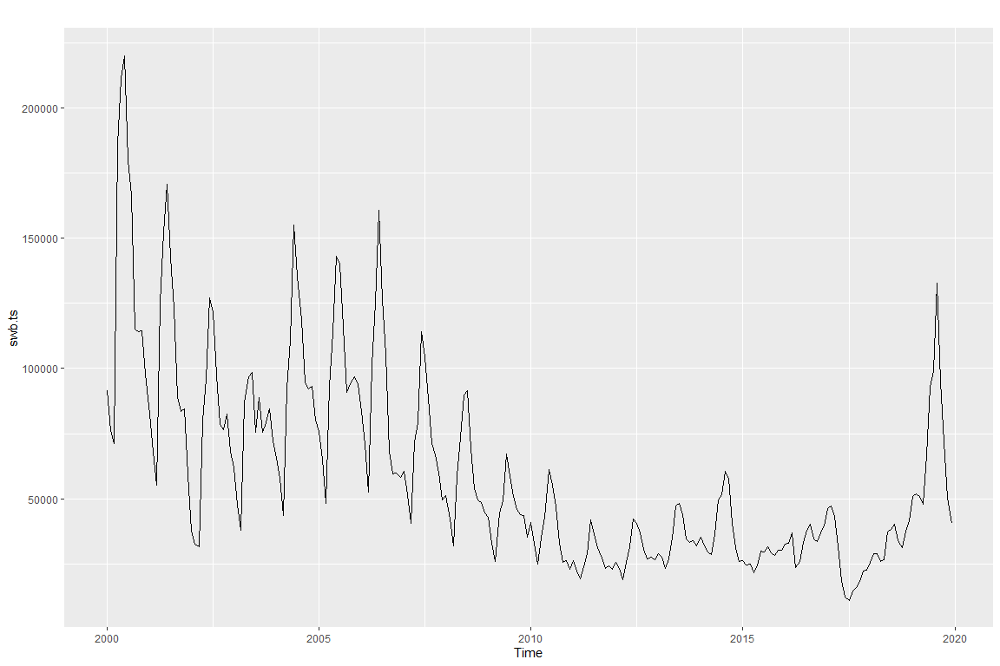<!-- -->

``` r
summary(swb.ts)
```

    ##    Min. 1st Qu.  Median    Mean 3rd Qu.    Max. 
    ##   11127   31576   47855   60498   82576  220063

``` r
hist(swb.ts)
```

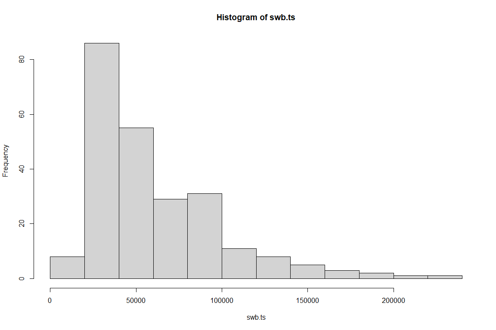<!-- -->

``` r
boxplot(swb.ts)
```

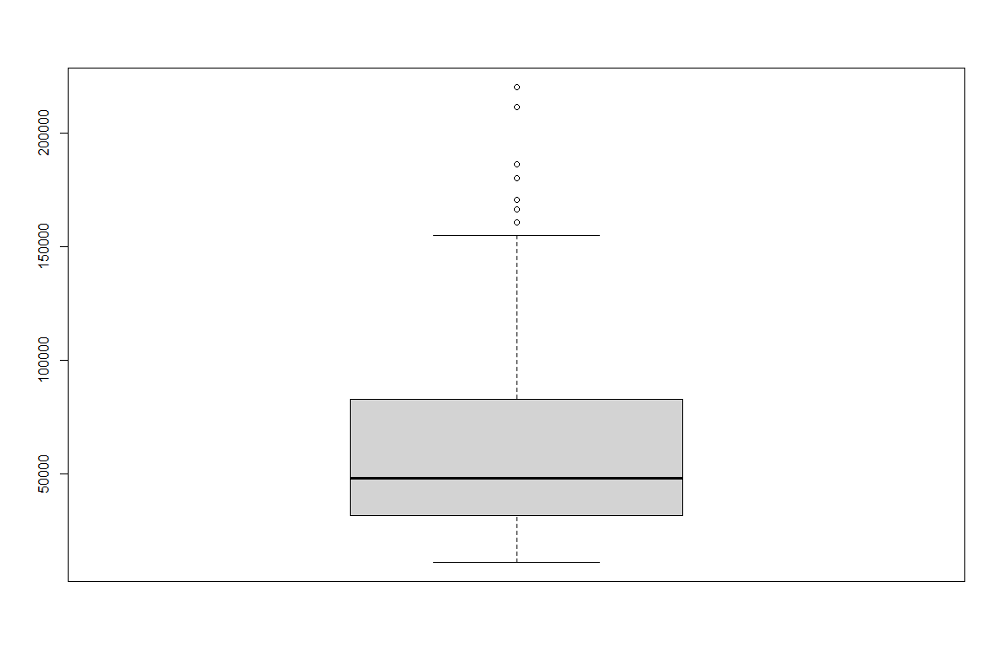<!-- -->

``` r
components <- decompose(swb.ts)
plot(components)
```

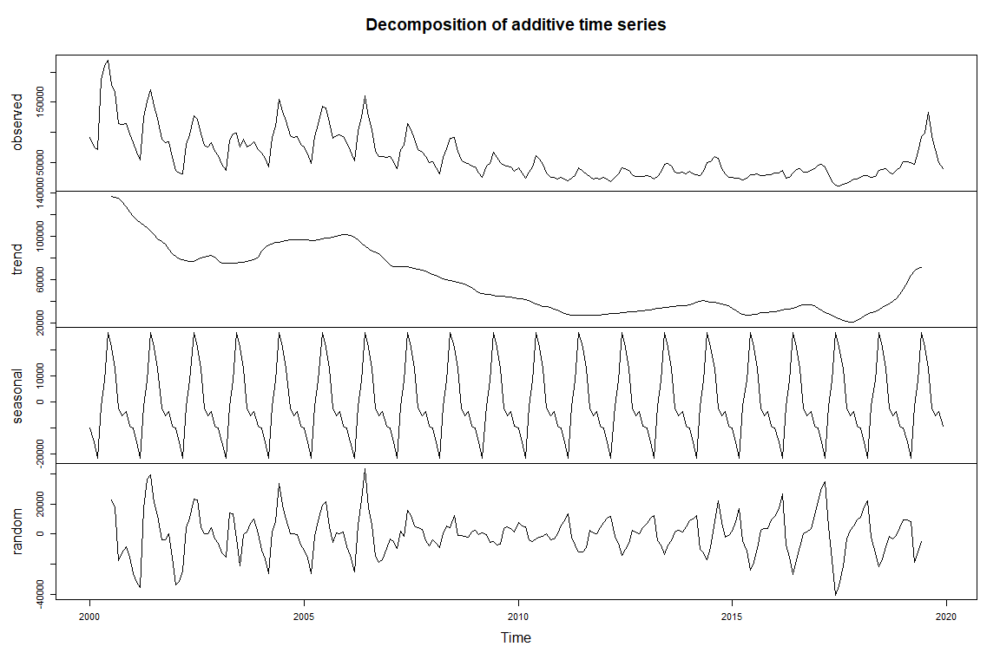<!-- -->

``` r
adf.test(swb.ts)
```

    ## Warning in adf.test(swb.ts): p-value smaller than printed p-value

    ## 
    ##  Augmented Dickey-Fuller Test
    ## 
    ## data:  swb.ts
    ## Dickey-Fuller = -5.1033, Lag order = 6, p-value = 0.01
    ## alternative hypothesis: stationary

``` r
acf(ts(((swb.ts))),main='ACF SW Border Encounters')
```

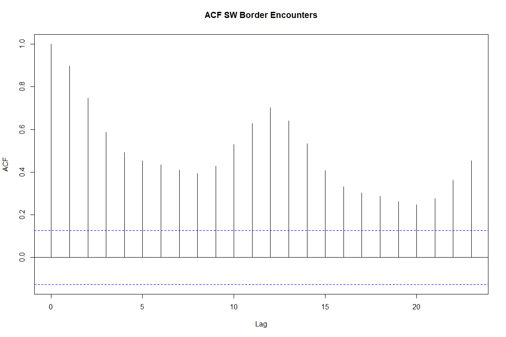<!-- -->

``` r
pacf(ts(((swb.ts))),main='PACF SW Border Encounters')
```

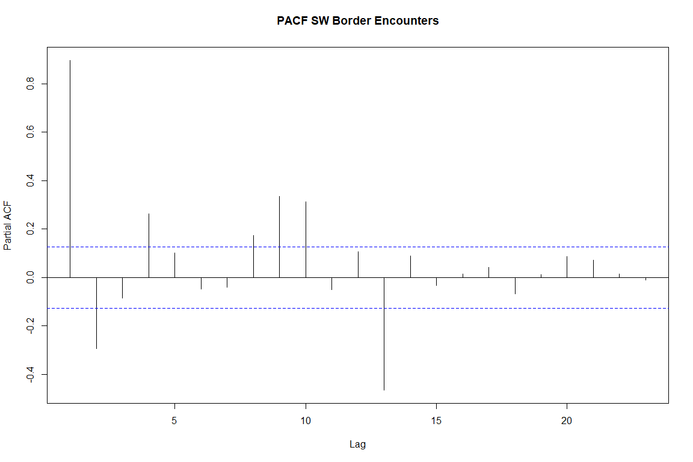<!-- -->

The data was also split into training and testing sets. The last 12
months of data are used for testing and accuracy purposes. The split is
seen in the chart below.

# Modeling Univariate Time Series

There are a wide range of options available to model a univariate time
series. There are traditional, statistically-based approaches such as
ARIMA and ETS. In addition, there a number machine learning and deep
learning routines that and be used as well. There are also a number of
packages in the R ecosystem that provide time series models as well as
utilities for plotting, forecasting and accuracy analysis.

One of the more recent tools is Facebook’s open source project Prophet.
Prophet "is a procedure for forecasting time series data based on an
additive model where non-linear trends are fit with yearly, weekly, and
daily seasonality, plus holiday effects. It works best with time series
that have strong seasonal effects and several seasons of historical
data. Prophet is robust to missing data and shifts in the trend, and
typically handles outliers well.

One of the biggest challenges with using different time series and
forecasting packages is that there are several formats for time series
object (e.g., ts, xts, tsibble). Different packages often require a
different data format and therefore the time series must be converted or
recreated. Instead of incorporating multiple packages, I decided to use
a “tidymodels” approach. Using the tidymodels and parsnip packages I was
able to use a common interface for multiple forecast models. WIth this
approach, I was able to easily create to following models:

-   ARIMA (using auto.arima

-   Linear Regression (with no trend)

-   Facebook Prophet

-   Random Forest

-   Extreme Gradient Boost (xgboost)

-   Support Vector Machine (with polynomial kernel)

-   Prophet with XGBoost

-   ARIMA with XGBoost

-   Neural Network ARIMA (feed-forward neural networks with a single
    hidden layer and lagged inputs

-   Exponential Smoothing (M,N,M)

``` r
# * ARIMA ----
model_fit_arima <- arima_reg() %>%
    set_engine("auto_arima") %>%
    fit(
        value ~ date, 
        data = training(splits)
    )

# * LINEAR REGRESSION ----
model_fit_lm <- linear_reg() %>%
    set_engine("lm") %>%
    fit(
        value ~ as.numeric(date) + month(date, label = TRUE), 
        data = training(splits)
    )

# * LINEAR REGRESSION - NO TREND ----
model_fit_lm_no_trend <- linear_reg() %>%
    set_engine("lm") %>%
    fit(
        value ~ month(date, label = TRUE), 
        data = training(splits)
    )

# * PROPHET ----
model_fit_prophet <- prophet_reg() %>%
    set_engine("prophet") %>%
    fit(
        value ~ date, 
        data = training(splits)
    )

# * RANDOM FOREST ----
model_fit_rf <- rand_forest(mode = "regression") %>%
    set_engine("randomForest") %>%
    fit(
        value ~ as.numeric(date) + month(date, label = TRUE), 
        data = training(splits)
    )

# * XGBOOST ----
model_fit_xgboost <- boost_tree(mode = "regression") %>%
    set_engine("xgboost") %>%
    fit(
        value ~ as.numeric(date) + month(date, label = TRUE), 
        data = training(splits)
    )

# * SVM - Polynomial ----
model_fit_svm_poly <- svm_poly(mode = "regression") %>%
    set_engine("kernlab") %>%
    fit(
        value ~ as.numeric(date) + month(date, label = TRUE), 
        data = training(splits)
    )
```

    ##  Setting default kernel parameters

``` r
# * SVM - RBF ----
model_fit_svm_rbf <- svm_rbf(mode = "regression") %>%
    set_engine("kernlab") %>%
    fit(
        value ~ as.numeric(date) + month(date, label = TRUE), 
        data = training(splits)
    )

# * PROPHET BOOST ----
model_fit_prophet_boost <- prophet_boost() %>%
    set_engine("prophet_xgboost") %>%
    fit(
        value ~ date + as.numeric(date) + month(date, label = TRUE), 
        data = training(splits)
    )

# * ARIMA BOOST ----
model_fit_arima_boost <- arima_boost() %>%
    set_engine("auto_arima_xgboost") %>%
    fit(
        value ~ date + as.numeric(date) + month(date, label = TRUE), 
        data = training(splits)
    )

model_fit_nn <- nnetar_reg() %>%
    set_engine(engine = "nnetar") %>%
    fit((value) ~ date, data = training(splits))

model_fit_ets <- exp_smoothing(
        seasonal_period  = 12,
        error            = "multiplicative",
        trend            = "none",
        season           = "multiplicative"
    ) %>%
    set_engine("ets") %>%
    fit((value) ~ date, data = training(splits))
```

In addition to tidyverse and parsnip, I also used Modeltime, a library
that extends tidymodels specifically for time series analysis and
forecasting. For example, Modeltime provides a data structure that can
be used to hold the results of the models created above. This data
structure is then used to support forecasting and accuracy analysis.

``` r
# * Modeltime Table ----
model_tbl <- modeltime_table(
    model_fit_arima,
    model_fit_lm_no_trend,
    model_fit_prophet,
    model_fit_rf,
    model_fit_xgboost,
    model_fit_svm_poly,
    model_fit_prophet_boost,
    model_fit_arima_boost,
    model_fit_nn,
    model_fit_ets
)
```

## Calibration and Plotting Against the Test Data

The Modeltime calibration process was used to model the test data set
and generate accuracy metrics. The following metrics were generated for
each of the models.

-   MAE: Mean absolute error

-   RMSE: Root mean squared error

-   MAPE: Mean absolute percentage error

-   MASE: Mean absolute scaled error

-   RSQ: R squared coefficient of determination

From the results in the table below we can see that the linear model and
the Prophet XGBoost models have the best combination of accuracy scores.

``` r
# * Calibrate ----
calibration_tbl <- model_tbl %>%
    modeltime_calibrate(testing(splits))

calibration_tbl %>%
    modeltime_accuracy(metric_set = metric_set(mae, rmse, mape, mase,  rsq)) %>%
    table_modeltime_accuracy(.interactive = FALSE)
```

<style>html {
  font-family: -apple-system, BlinkMacSystemFont, 'Segoe UI', Roboto, Oxygen, Ubuntu, Cantarell, 'Helvetica Neue', 'Fira Sans', 'Droid Sans', Arial, sans-serif;
}

#mzrlbcjcrg .gt_table {
  display: table;
  border-collapse: collapse;
  margin-left: auto;
  margin-right: auto;
  color: #333333;
  font-size: 16px;
  font-weight: normal;
  font-style: normal;
  background-color: #FFFFFF;
  width: auto;
  border-top-style: solid;
  border-top-width: 2px;
  border-top-color: #A8A8A8;
  border-right-style: none;
  border-right-width: 2px;
  border-right-color: #D3D3D3;
  border-bottom-style: solid;
  border-bottom-width: 2px;
  border-bottom-color: #A8A8A8;
  border-left-style: none;
  border-left-width: 2px;
  border-left-color: #D3D3D3;
}

#mzrlbcjcrg .gt_heading {
  background-color: #FFFFFF;
  text-align: center;
  border-bottom-color: #FFFFFF;
  border-left-style: none;
  border-left-width: 1px;
  border-left-color: #D3D3D3;
  border-right-style: none;
  border-right-width: 1px;
  border-right-color: #D3D3D3;
}

#mzrlbcjcrg .gt_title {
  color: #333333;
  font-size: 125%;
  font-weight: initial;
  padding-top: 4px;
  padding-bottom: 4px;
  border-bottom-color: #FFFFFF;
  border-bottom-width: 0;
}

#mzrlbcjcrg .gt_subtitle {
  color: #333333;
  font-size: 85%;
  font-weight: initial;
  padding-top: 0;
  padding-bottom: 4px;
  border-top-color: #FFFFFF;
  border-top-width: 0;
}

#mzrlbcjcrg .gt_bottom_border {
  border-bottom-style: solid;
  border-bottom-width: 2px;
  border-bottom-color: #D3D3D3;
}

#mzrlbcjcrg .gt_col_headings {
  border-top-style: solid;
  border-top-width: 2px;
  border-top-color: #D3D3D3;
  border-bottom-style: solid;
  border-bottom-width: 2px;
  border-bottom-color: #D3D3D3;
  border-left-style: none;
  border-left-width: 1px;
  border-left-color: #D3D3D3;
  border-right-style: none;
  border-right-width: 1px;
  border-right-color: #D3D3D3;
}

#mzrlbcjcrg .gt_col_heading {
  color: #333333;
  background-color: #FFFFFF;
  font-size: 100%;
  font-weight: normal;
  text-transform: inherit;
  border-left-style: none;
  border-left-width: 1px;
  border-left-color: #D3D3D3;
  border-right-style: none;
  border-right-width: 1px;
  border-right-color: #D3D3D3;
  vertical-align: bottom;
  padding-top: 5px;
  padding-bottom: 6px;
  padding-left: 5px;
  padding-right: 5px;
  overflow-x: hidden;
}

#mzrlbcjcrg .gt_column_spanner_outer {
  color: #333333;
  background-color: #FFFFFF;
  font-size: 100%;
  font-weight: normal;
  text-transform: inherit;
  padding-top: 0;
  padding-bottom: 0;
  padding-left: 4px;
  padding-right: 4px;
}

#mzrlbcjcrg .gt_column_spanner_outer:first-child {
  padding-left: 0;
}

#mzrlbcjcrg .gt_column_spanner_outer:last-child {
  padding-right: 0;
}

#mzrlbcjcrg .gt_column_spanner {
  border-bottom-style: solid;
  border-bottom-width: 2px;
  border-bottom-color: #D3D3D3;
  vertical-align: bottom;
  padding-top: 5px;
  padding-bottom: 6px;
  overflow-x: hidden;
  display: inline-block;
  width: 100%;
}

#mzrlbcjcrg .gt_group_heading {
  padding: 8px;
  color: #333333;
  background-color: #FFFFFF;
  font-size: 100%;
  font-weight: initial;
  text-transform: inherit;
  border-top-style: solid;
  border-top-width: 2px;
  border-top-color: #D3D3D3;
  border-bottom-style: solid;
  border-bottom-width: 2px;
  border-bottom-color: #D3D3D3;
  border-left-style: none;
  border-left-width: 1px;
  border-left-color: #D3D3D3;
  border-right-style: none;
  border-right-width: 1px;
  border-right-color: #D3D3D3;
  vertical-align: middle;
}

#mzrlbcjcrg .gt_empty_group_heading {
  padding: 0.5px;
  color: #333333;
  background-color: #FFFFFF;
  font-size: 100%;
  font-weight: initial;
  border-top-style: solid;
  border-top-width: 2px;
  border-top-color: #D3D3D3;
  border-bottom-style: solid;
  border-bottom-width: 2px;
  border-bottom-color: #D3D3D3;
  vertical-align: middle;
}

#mzrlbcjcrg .gt_from_md > :first-child {
  margin-top: 0;
}

#mzrlbcjcrg .gt_from_md > :last-child {
  margin-bottom: 0;
}

#mzrlbcjcrg .gt_row {
  padding-top: 8px;
  padding-bottom: 8px;
  padding-left: 5px;
  padding-right: 5px;
  margin: 10px;
  border-top-style: solid;
  border-top-width: 1px;
  border-top-color: #D3D3D3;
  border-left-style: none;
  border-left-width: 1px;
  border-left-color: #D3D3D3;
  border-right-style: none;
  border-right-width: 1px;
  border-right-color: #D3D3D3;
  vertical-align: middle;
  overflow-x: hidden;
}

#mzrlbcjcrg .gt_stub {
  color: #333333;
  background-color: #FFFFFF;
  font-size: 100%;
  font-weight: initial;
  text-transform: inherit;
  border-right-style: solid;
  border-right-width: 2px;
  border-right-color: #D3D3D3;
  padding-left: 12px;
}

#mzrlbcjcrg .gt_summary_row {
  color: #333333;
  background-color: #FFFFFF;
  text-transform: inherit;
  padding-top: 8px;
  padding-bottom: 8px;
  padding-left: 5px;
  padding-right: 5px;
}

#mzrlbcjcrg .gt_first_summary_row {
  padding-top: 8px;
  padding-bottom: 8px;
  padding-left: 5px;
  padding-right: 5px;
  border-top-style: solid;
  border-top-width: 2px;
  border-top-color: #D3D3D3;
}

#mzrlbcjcrg .gt_grand_summary_row {
  color: #333333;
  background-color: #FFFFFF;
  text-transform: inherit;
  padding-top: 8px;
  padding-bottom: 8px;
  padding-left: 5px;
  padding-right: 5px;
}

#mzrlbcjcrg .gt_first_grand_summary_row {
  padding-top: 8px;
  padding-bottom: 8px;
  padding-left: 5px;
  padding-right: 5px;
  border-top-style: double;
  border-top-width: 6px;
  border-top-color: #D3D3D3;
}

#mzrlbcjcrg .gt_striped {
  background-color: rgba(128, 128, 128, 0.05);
}

#mzrlbcjcrg .gt_table_body {
  border-top-style: solid;
  border-top-width: 2px;
  border-top-color: #D3D3D3;
  border-bottom-style: solid;
  border-bottom-width: 2px;
  border-bottom-color: #D3D3D3;
}

#mzrlbcjcrg .gt_footnotes {
  color: #333333;
  background-color: #FFFFFF;
  border-bottom-style: none;
  border-bottom-width: 2px;
  border-bottom-color: #D3D3D3;
  border-left-style: none;
  border-left-width: 2px;
  border-left-color: #D3D3D3;
  border-right-style: none;
  border-right-width: 2px;
  border-right-color: #D3D3D3;
}

#mzrlbcjcrg .gt_footnote {
  margin: 0px;
  font-size: 90%;
  padding: 4px;
}

#mzrlbcjcrg .gt_sourcenotes {
  color: #333333;
  background-color: #FFFFFF;
  border-bottom-style: none;
  border-bottom-width: 2px;
  border-bottom-color: #D3D3D3;
  border-left-style: none;
  border-left-width: 2px;
  border-left-color: #D3D3D3;
  border-right-style: none;
  border-right-width: 2px;
  border-right-color: #D3D3D3;
}

#mzrlbcjcrg .gt_sourcenote {
  font-size: 90%;
  padding: 4px;
}

#mzrlbcjcrg .gt_left {
  text-align: left;
}

#mzrlbcjcrg .gt_center {
  text-align: center;
}

#mzrlbcjcrg .gt_right {
  text-align: right;
  font-variant-numeric: tabular-nums;
}

#mzrlbcjcrg .gt_font_normal {
  font-weight: normal;
}

#mzrlbcjcrg .gt_font_bold {
  font-weight: bold;
}

#mzrlbcjcrg .gt_font_italic {
  font-style: italic;
}

#mzrlbcjcrg .gt_super {
  font-size: 65%;
}

#mzrlbcjcrg .gt_footnote_marks {
  font-style: italic;
  font-size: 65%;
}
</style>
<div id="mzrlbcjcrg" style="overflow-x:auto;overflow-y:auto;width:auto;height:auto;"><table class="gt_table">
  <thead class="gt_header">
    <tr>
      <th colspan="8" class="gt_heading gt_title gt_font_normal" style>Accuracy Table</th>
    </tr>
    <tr>
      <th colspan="8" class="gt_heading gt_subtitle gt_font_normal gt_bottom_border" style></th>
    </tr>
  </thead>
  <thead class="gt_col_headings">
    <tr>
      <th class="gt_col_heading gt_columns_bottom_border gt_center" rowspan="1" colspan="1">.model_id</th>
      <th class="gt_col_heading gt_columns_bottom_border gt_left" rowspan="1" colspan="1">.model_desc</th>
      <th class="gt_col_heading gt_columns_bottom_border gt_left" rowspan="1" colspan="1">.type</th>
      <th class="gt_col_heading gt_columns_bottom_border gt_right" rowspan="1" colspan="1">mae</th>
      <th class="gt_col_heading gt_columns_bottom_border gt_right" rowspan="1" colspan="1">rmse</th>
      <th class="gt_col_heading gt_columns_bottom_border gt_right" rowspan="1" colspan="1">mape</th>
      <th class="gt_col_heading gt_columns_bottom_border gt_right" rowspan="1" colspan="1">mase</th>
      <th class="gt_col_heading gt_columns_bottom_border gt_right" rowspan="1" colspan="1">rsq</th>
    </tr>
  </thead>
  <tbody class="gt_table_body">
    <tr>
      <td class="gt_row gt_center">1</td>
      <td class="gt_row gt_left">ARIMA(3,1,1)(2,1,1)[12]</td>
      <td class="gt_row gt_left">Test</td>
      <td class="gt_row gt_right">27502.33</td>
      <td class="gt_row gt_right">38018.36</td>
      <td class="gt_row gt_right">31.28</td>
      <td class="gt_row gt_right">1.66</td>
      <td class="gt_row gt_right">0.01</td>
    </tr>
    <tr>
      <td class="gt_row gt_center">2</td>
      <td class="gt_row gt_left">LM</td>
      <td class="gt_row gt_left">Test</td>
      <td class="gt_row gt_right">16331.87</td>
      <td class="gt_row gt_right">23171.90</td>
      <td class="gt_row gt_right">20.68</td>
      <td class="gt_row gt_right">0.99</td>
      <td class="gt_row gt_right">0.44</td>
    </tr>
    <tr>
      <td class="gt_row gt_center">3</td>
      <td class="gt_row gt_left">PROPHET</td>
      <td class="gt_row gt_left">Test</td>
      <td class="gt_row gt_right">47097.30</td>
      <td class="gt_row gt_right">51120.72</td>
      <td class="gt_row gt_right">67.42</td>
      <td class="gt_row gt_right">2.85</td>
      <td class="gt_row gt_right">0.48</td>
    </tr>
    <tr>
      <td class="gt_row gt_center">4</td>
      <td class="gt_row gt_left">RANDOMFOREST</td>
      <td class="gt_row gt_left">Test</td>
      <td class="gt_row gt_right">37305.90</td>
      <td class="gt_row gt_right">45744.61</td>
      <td class="gt_row gt_right">46.44</td>
      <td class="gt_row gt_right">2.26</td>
      <td class="gt_row gt_right">0.10</td>
    </tr>
    <tr>
      <td class="gt_row gt_center">5</td>
      <td class="gt_row gt_left">XGBOOST</td>
      <td class="gt_row gt_left">Test</td>
      <td class="gt_row gt_right">35340.66</td>
      <td class="gt_row gt_right">44263.88</td>
      <td class="gt_row gt_right">43.20</td>
      <td class="gt_row gt_right">2.14</td>
      <td class="gt_row gt_right">0.04</td>
    </tr>
    <tr>
      <td class="gt_row gt_center">6</td>
      <td class="gt_row gt_left">KERNLAB</td>
      <td class="gt_row gt_left">Test</td>
      <td class="gt_row gt_right">61048.57</td>
      <td class="gt_row gt_right">64285.33</td>
      <td class="gt_row gt_right">88.74</td>
      <td class="gt_row gt_right">3.69</td>
      <td class="gt_row gt_right">0.52</td>
    </tr>
    <tr>
      <td class="gt_row gt_center">7</td>
      <td class="gt_row gt_left">PROPHET W/ XGBOOST ERRORS</td>
      <td class="gt_row gt_left">Test</td>
      <td class="gt_row gt_right">29290.83</td>
      <td class="gt_row gt_right">35423.97</td>
      <td class="gt_row gt_right">37.17</td>
      <td class="gt_row gt_right">1.77</td>
      <td class="gt_row gt_right">0.79</td>
    </tr>
    <tr>
      <td class="gt_row gt_center">8</td>
      <td class="gt_row gt_left">ARIMA(3,1,2)(0,1,2)[12] W/ XGBOOST ERRORS</td>
      <td class="gt_row gt_left">Test</td>
      <td class="gt_row gt_right">29405.51</td>
      <td class="gt_row gt_right">41473.74</td>
      <td class="gt_row gt_right">32.56</td>
      <td class="gt_row gt_right">1.78</td>
      <td class="gt_row gt_right">0.24</td>
    </tr>
    <tr>
      <td class="gt_row gt_center">9</td>
      <td class="gt_row gt_left">NNAR(1,1,10)[12]</td>
      <td class="gt_row gt_left">Test</td>
      <td class="gt_row gt_right">37711.86</td>
      <td class="gt_row gt_right">46502.15</td>
      <td class="gt_row gt_right">46.72</td>
      <td class="gt_row gt_right">2.28</td>
      <td class="gt_row gt_right">0.01</td>
    </tr>
    <tr>
      <td class="gt_row gt_center">10</td>
      <td class="gt_row gt_left">ETS(M,N,M)</td>
      <td class="gt_row gt_left">Test</td>
      <td class="gt_row gt_right">32133.94</td>
      <td class="gt_row gt_right">40211.74</td>
      <td class="gt_row gt_right">39.63</td>
      <td class="gt_row gt_right">1.94</td>
      <td class="gt_row gt_right">0.19</td>
    </tr>
  </tbody>
  
  
</table></div>

``` r
calibration_tbl %>%
    modeltime_forecast(
        new_data = testing(splits), 
        actual_data = data_prepared_tbl,
        conf_interval = 0.80
    ) %>%
    plot_modeltime_forecast(.legend_show = TRUE, 
                            .legend_max_width = 25,
                            .interactive=FALSE)
```

    ## Warning in max(ids, na.rm = TRUE): no non-missing arguments to max; returning -
    ## Inf

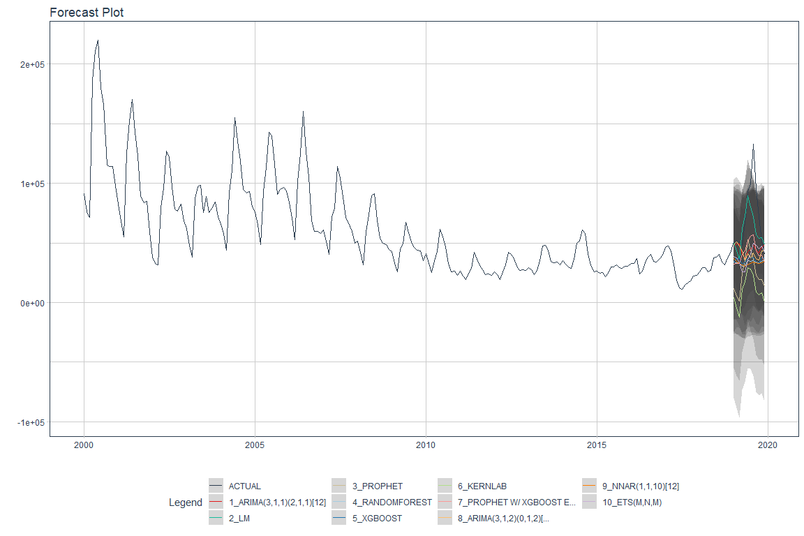<!-- -->

## Generating the Forward-Looking Forecasts

The true test of a time series model is how will it predicts future
periods. Using Modeltime routines we were able to refit and forecast
data for the 12 months following the dates of our time series. The
results are plotted below.

``` r
# * Refit ----
refit_tbl <- calibration_tbl %>%
    modeltime_refit(data = data_prepared_tbl) 
```

    ##  Setting default kernel parameters

``` r
forecast_tbl <- refit_tbl %>%
    modeltime_forecast(
        h = "1 year",
        actual_data = data_prepared_tbl,
        conf_interval = 0.95
    ) 

forecast_tbl %>%
    plot_modeltime_forecast(.interactive = FALSE)
```

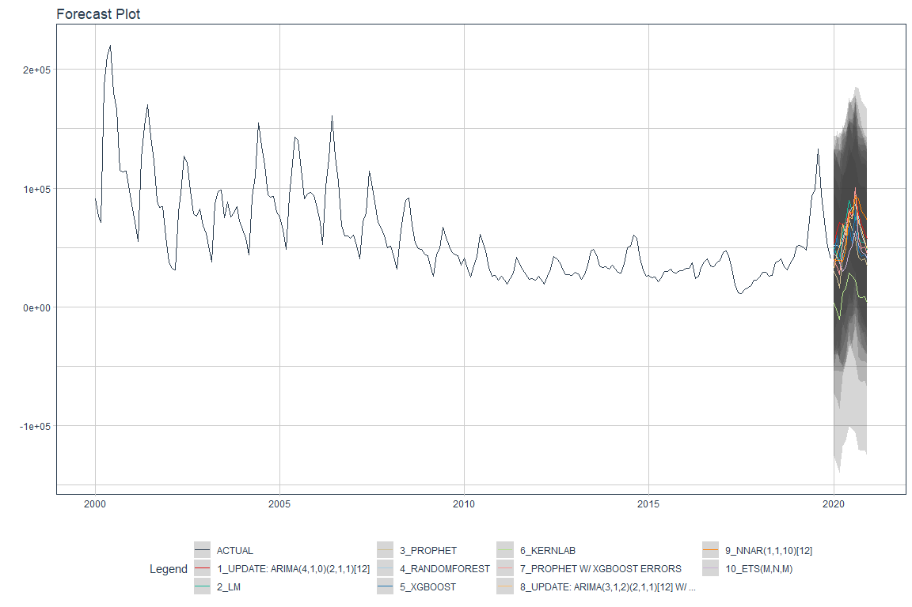<!-- -->

## Creating and Visualizing a Composite Forecast

The final step in forecasting is to generate a composite forecast. In
this case we average the results of the individual models to create a
mean forecast. The results of this forecast as shown below.

``` r
# 4.0 MODEL AVERAGING ----

# * Mean Forecast ----
mean_forecast_tbl <- forecast_tbl %>%
    filter(.key != "actual") %>%
    group_by(.key, .index) %>%
    summarise(across(.value:.conf_hi, mean)) %>%
    mutate(
        .model_id   = 12,
        .model_desc = "AVERAGE OF MODELS"
    )

# * Visualize Mean Forecast ----
forecast_tbl %>%
    filter(.key == "actual") %>%
    bind_rows(mean_forecast_tbl) %>%
    plot_modeltime_forecast(.interactive = FALSE)
```

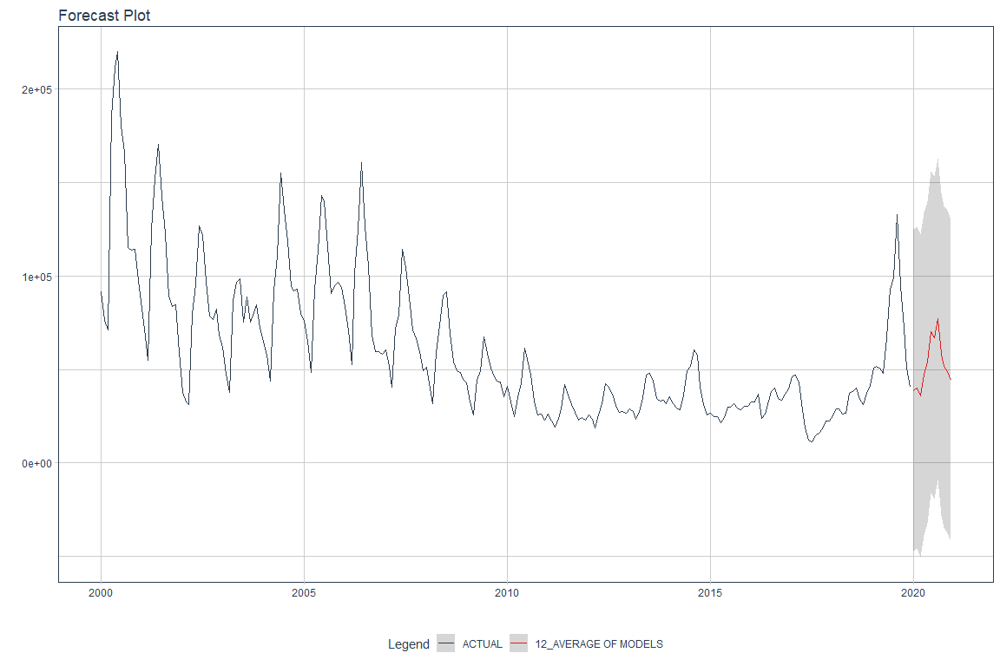<!-- -->

# Accuracy Versus 2020 Actual Results

Given the models and the forecasts, we next examine the results compared
to the actual results for the year 2020. These are published on the USBP
web site but not yet incorporated into the yearly PDF report. Therefore,
these numbers were not including in the modeling but are used to compare
the forecasts from the models with the reality of what actually occurred
during the forecast period.

After some data wrangling, we are able to see the 2020 forecast plotted
against the individual forecasts. It is interesting to note that none of
the forecasts were able to accurately anticipate the drop in border
encounters that occurred midway through 2020 as borders were closed to
all but essential traffic due to the COVID-19 pandemic. In addition,
USBP did not accept any claims of asylum during this period and returned
any migrants using its Title 42 authorities, which allow the return of
migrants for public health reasons.

The table of accuracy metrics is also provided and indicates that the
ETS and Random Forrest models were relatively accurate.

``` r
autoplot(all2020Preds) +
    ggtitle('Plot of Predicions vs 2020 Actuals')
```

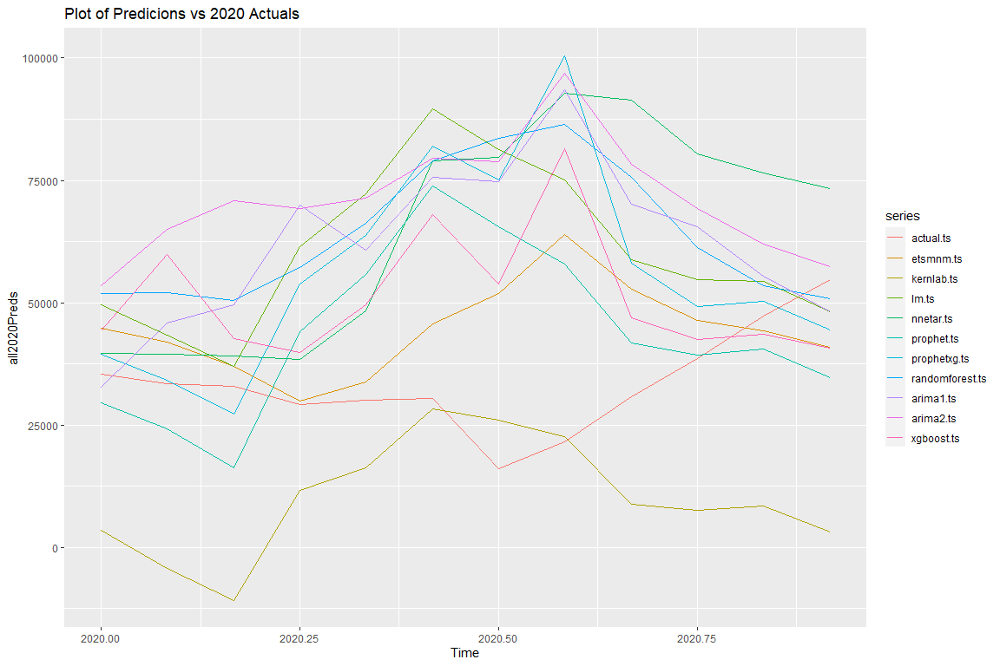<!-- -->

``` r
kable(round(all_metrics.tib, 2), type="text")
```

|              |   mape |     rmse | mase |      mae |  rsq |
|:-------------|-------:|---------:|-----:|---------:|-----:|
| Actual       |   0.00 |     0.00 | 0.00 |     0.00 | 1.00 |
| ETS          |  55.76 | 18784.63 | 2.53 | 13865.18 | 0.11 |
| Kernlab      |  70.15 | 29657.42 | 4.58 | 25078.29 | 0.27 |
| LM           | 111.52 | 35236.13 | 5.16 | 28212.99 | 0.33 |
| NNetAR       | 118.71 | 39380.48 | 5.75 | 31468.59 | 0.00 |
| Prophet      |  77.92 | 24971.04 | 3.65 | 19986.10 | 0.24 |
| ProphetXG    | 105.62 | 35503.88 | 4.71 | 25770.01 | 0.32 |
| RandomForest | 122.72 | 37303.39 | 5.72 | 31266.53 | 0.52 |
| Arima1       | 117.33 | 36623.46 | 5.48 | 30001.27 | 0.35 |
| Arima2       | 141.88 | 42341.18 | 6.88 | 37639.36 | 0.51 |
| XGBoost      |  80.41 | 26248.11 | 3.78 | 20683.78 | 0.29 |

# Multivariate Time Series Analysis

It seems rather clear from a multivariate analysis of the USBP Southwest
Border encounters that there are external factors impacting the time
series. Immigration is a complex phenomenon that is influenced by
social, political, and economic events that happen both in the migrant’s
home country (push factors) and those in the US (pull factors). This
leads us to the next part of this analysis, that of multivariate time
series analysis.

It is difficult to identify potential factors that can be quantified and
it is equally difficult to find data sources that are recorded over the
period of study and at the proper level of granularity (i.e., monthly).
Rather than providing a specific answer to the question of which factors
impact immigration, this analysis seeks rather to illustrate the process
of incorporating external variables into a time series analysis.

Therefore, there are three additional economic series incorporated into
the analysis. They are:

-   US Gross Domestic Product

-   US Housing Starts

-   US Unemployment

The data was acquired from the Federal Reserve Economic Data web site
(fred.stlouisfed.org). These three particular data sets are recorded on
a monthly basis and are available for dates that include the period of
study. The data was downloaded from the web site and combined into an
Excel spreadsheet. The the combined spreadsheet, I created three
separate time series and then windowed them to include on same time
period as the border encounters. The data was also scaled and centered
and then combined into one ts object for plotting purposes.

There are some interesting observations that can be made from the
combined plot of the scaled and centered data. For example, the spike in
unemployment and the drop in GDP around 2009 seem to correspond to a
decreasing trend in border encounters. In addition, the increase in
housing starts appears to correspond to an increasing trend in border
encounters.

``` r
combined.ts <- cbind(swb.scaled.ts, gdp.scaled.ts, housing.scaled.ts, unemp.scaled.ts )
autoplot(combined.ts) +
  ggtitle('Plot of Scaled Series')
```

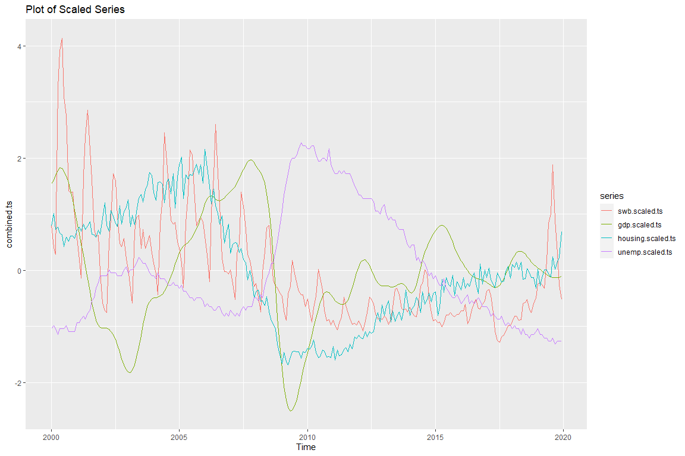<!-- -->

# Exploratory Data Analysis

For exploratory data analysis, we first look at the correlations among
the different series. The most significantly correlated series with the
SW Border encounters is US Housing Starts. This will be the focus of the
analysis going forward.

The cross correlation plot housing starts with the border encounters
again shows the correlation to specific lags indicating the housing
starts may be both a leading and a lagging indicator. We also calculate
the ADF statistic to examine stationarity. Finally, we determine the
number of differences that might be used to make the series stationary.

``` r
stargazer(cor(combined.ts), type="text")
```

    ## 
    ## ===============================================================================
    ##                   swb.scaled.ts gdp.scaled.ts housing.scaled.ts unemp.scaled.ts
    ## -------------------------------------------------------------------------------
    ## swb.scaled.ts           1           0.269           0.596           -0.369     
    ## gdp.scaled.ts         0.269           1             0.274           -0.574     
    ## housing.scaled.ts     0.596         0.274             1             -0.658     
    ## unemp.scaled.ts      -0.369        -0.574          -0.658              1       
    ## -------------------------------------------------------------------------------

``` r
ccf(combined.ts[,1], combined.ts[,3],main="CCF Housing Starts")
```

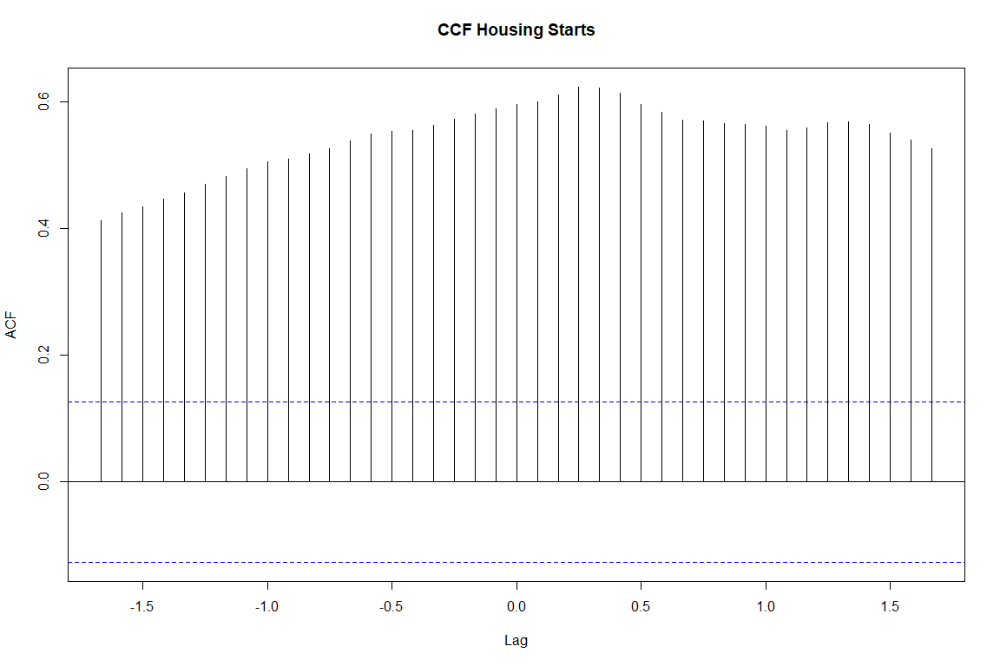<!-- -->

``` r
## ADF Tests:  Null hypothesis--Not stationary.  p-value <0.5 reject Null

adf.test(combined.ts[,3])
```

    ## 
    ##  Augmented Dickey-Fuller Test
    ## 
    ## data:  combined.ts[, 3]
    ## Dickey-Fuller = -0.80294, Lag order = 6, p-value = 0.9603
    ## alternative hypothesis: stationary

``` r
ndiffs((combined.ts[,1]))
```

    ## [1] 1

``` r
ndiffs((combined.ts[,3]))
```

    ## [1] 1

As with the univariate series, the data is split into training and
testing sets. For this analysis, the testing set contains the last two
years of data.

``` r
x=combined.ts[,1]
y=combined.ts[,3]
ndiffs(x, test="kpss")
```

    ## [1] 1

``` r
ndiffs(y, test="kpss")
```

    ## [1] 1

``` r
Granger <- cbind(y,x)
dGranger <- diff(Granger)

lag=VARselect(dGranger, lag.max=13)
lag$selection
```

    ## AIC(n)  HQ(n)  SC(n) FPE(n) 
    ##     12     12     12     12

## Multivariate Results

Using AIC as the lag selection metric, we us the VARS package to create
a vector autoregression model. The results displayed below show the
results for both models: one to predict x and one to predict y. For the
y model it appears that the only significant lags are lags of y itself.
The same is true for the x model, as well.

The portmanteau test is used to determine the presence of multivariate
autocorrelation. From the results of the test the null hypothesis is
rejected (p&lt;=0.05). That is, autocorrelations are not zero.

However, the Granger causality tests provide additional relevant
information here. According the the Granger tests, neither series can be
said to statistically “cause” the other at a p&lt;= 0.05. Threshold.
However, the p-values for both tests are relatively close to 0.10. We
might therefore be able to conclude that there is Granger causality if
we relax the threshold value for p.

``` r
lag12 <- vars::VAR(dGranger, p=12)
summary(lag12)
```

    ## 
    ## VAR Estimation Results:
    ## ========================= 
    ## Endogenous variables: y, x 
    ## Deterministic variables: const 
    ## Sample size: 227 
    ## Log Likelihood: 120.642 
    ## Roots of the characteristic polynomial:
    ## 0.9815 0.9815 0.9804 0.9804 0.9801 0.9801 0.9629 0.9506 0.9506 0.9131 0.9089 0.9089 0.9011 0.9011 0.893 0.893 0.8861 0.8861 0.8742 0.8742 0.7732 0.7732 0.7309 0.5227
    ## Call:
    ## vars::VAR(y = dGranger, p = 12)
    ## 
    ## 
    ## Estimation results for equation y: 
    ## ================================== 
    ## y = y.l1 + x.l1 + y.l2 + x.l2 + y.l3 + x.l3 + y.l4 + x.l4 + y.l5 + x.l5 + y.l6 + x.l6 + y.l7 + x.l7 + y.l8 + x.l8 + y.l9 + x.l9 + y.l10 + x.l10 + y.l11 + x.l11 + y.l12 + x.l12 + const 
    ## 
    ##        Estimate Std. Error t value Pr(>|t|)    
    ## y.l1  -0.547863   0.070810  -7.737 4.76e-13 ***
    ## x.l1  -0.033356   0.048058  -0.694 0.488432    
    ## y.l2  -0.195032   0.080150  -2.433 0.015831 *  
    ## x.l2  -0.042745   0.046855  -0.912 0.362712    
    ## y.l3   0.060195   0.081233   0.741 0.459543    
    ## x.l3   0.098357   0.047053   2.090 0.037838 *  
    ## y.l4   0.289225   0.081085   3.567 0.000451 ***
    ## x.l4   0.034451   0.048826   0.706 0.481257    
    ## y.l5   0.182192   0.083743   2.176 0.030746 *  
    ## x.l5  -0.095623   0.049312  -1.939 0.053879 .  
    ## y.l6   0.089394   0.084755   1.055 0.292808    
    ## x.l6  -0.034914   0.048482  -0.720 0.472271    
    ## y.l7  -0.044999   0.084279  -0.534 0.593976    
    ## x.l7   0.108109   0.048387   2.234 0.026561 *  
    ## y.l8   0.029238   0.083590   0.350 0.726871    
    ## x.l8   0.052196   0.047250   1.105 0.270614    
    ## y.l9   0.065866   0.081565   0.808 0.420311    
    ## x.l9  -0.044298   0.047725  -0.928 0.354415    
    ## y.l10  0.090177   0.081775   1.103 0.271454    
    ## x.l10 -0.008078   0.042236  -0.191 0.848524    
    ## y.l11  0.163470   0.080186   2.039 0.042790 *  
    ## x.l11  0.012627   0.041701   0.303 0.762355    
    ## y.l12 -0.083409   0.070910  -1.176 0.240870    
    ## x.l12  0.059869   0.041932   1.428 0.154902    
    ## const  0.002074   0.012349   0.168 0.866770    
    ## ---
    ## Signif. codes:  0 '***' 0.001 '**' 0.01 '*' 0.05 '.' 0.1 ' ' 1
    ## 
    ## 
    ## Residual standard error: 0.1831 on 202 degrees of freedom
    ## Multiple R-Squared: 0.3437,  Adjusted R-squared: 0.2657 
    ## F-statistic: 4.407 on 24 and 202 DF,  p-value: 1.759e-09 
    ## 
    ## 
    ## Estimation results for equation x: 
    ## ================================== 
    ## x = y.l1 + x.l1 + y.l2 + x.l2 + y.l3 + x.l3 + y.l4 + x.l4 + y.l5 + x.l5 + y.l6 + x.l6 + y.l7 + x.l7 + y.l8 + x.l8 + y.l9 + x.l9 + y.l10 + x.l10 + y.l11 + x.l11 + y.l12 + x.l12 + const 
    ## 
    ##        Estimate Std. Error t value Pr(>|t|)    
    ## y.l1  -0.004076   0.082205  -0.050 0.960504    
    ## x.l1   0.047658   0.055792   0.854 0.394006    
    ## y.l2   0.019830   0.093048   0.213 0.831454    
    ## x.l2   0.026818   0.054395   0.493 0.622533    
    ## y.l3   0.149117   0.094305   1.581 0.115393    
    ## x.l3  -0.239031   0.054625  -4.376 1.94e-05 ***
    ## y.l4   0.182979   0.094134   1.944 0.053307 .  
    ## x.l4  -0.226141   0.056684  -3.990 9.26e-05 ***
    ## y.l5   0.136592   0.097219   1.405 0.161560    
    ## x.l5  -0.023695   0.057248  -0.414 0.679387    
    ## y.l6  -0.066379   0.098395  -0.675 0.500687    
    ## x.l6  -0.056186   0.056284  -0.998 0.319348    
    ## y.l7   0.081871   0.097842   0.837 0.403714    
    ## x.l7  -0.130427   0.056173  -2.322 0.021236 *  
    ## y.l8  -0.037527   0.097042  -0.387 0.699376    
    ## x.l8  -0.203274   0.054854  -3.706 0.000272 ***
    ## y.l9   0.076653   0.094691   0.810 0.419175    
    ## x.l9  -0.077596   0.055406  -1.401 0.162893    
    ## y.l10  0.066581   0.094935   0.701 0.483899    
    ## x.l10  0.005324   0.049033   0.109 0.913641    
    ## y.l11  0.130559   0.093090   1.403 0.162301    
    ## x.l11 -0.169145   0.048412  -3.494 0.000585 ***
    ## y.l12  0.148650   0.082321   1.806 0.072447 .  
    ## x.l12  0.514264   0.048680  10.564  < 2e-16 ***
    ## const -0.007111   0.014336  -0.496 0.620419    
    ## ---
    ## Signif. codes:  0 '***' 0.001 '**' 0.01 '*' 0.05 '.' 0.1 ' ' 1
    ## 
    ## 
    ## Residual standard error: 0.2126 on 202 degrees of freedom
    ## Multiple R-Squared: 0.7442,  Adjusted R-squared: 0.7138 
    ## F-statistic: 24.48 on 24 and 202 DF,  p-value: < 2.2e-16 
    ## 
    ## 
    ## 
    ## Covariance matrix of residuals:
    ##           y         x
    ## y  0.033530 -0.004447
    ## x -0.004447  0.045190
    ## 
    ## Correlation matrix of residuals:
    ##         y       x
    ## y  1.0000 -0.1142
    ## x -0.1142  1.0000

``` r
serial.test(lag12, type="PT.asymptotic")
```

    ## 
    ##  Portmanteau Test (asymptotic)
    ## 
    ## data:  Residuals of VAR object lag12
    ## Chi-squared = 43.154, df = 16, p-value = 0.0002649

``` r
## Reject null:  Residuals are not correlated

x2y <- causality(lag12, cause="x")
y2x <- causality(lag12, cause="y")

x2y$Granger
```

    ## 
    ##  Granger causality H0: x do not Granger-cause y
    ## 
    ## data:  VAR object lag12
    ## F-Test = 1.4737, df1 = 12, df2 = 404, p-value = 0.131

``` r
y2x$Granger
```

    ## 
    ##  Granger causality H0: y do not Granger-cause x
    ## 
    ## data:  VAR object lag12
    ## F-Test = 1.5612, df1 = 12, df2 = 404, p-value = 0.1003

The last step is to use the vector autoregression model to product a
forecast of future periods. The predict function provides a point
forecast, in this case, for the next 24 months with confidence intervals
of 0.95. Since the values are scaled and centered, we will need to
“unscale” them for forecasting purposes.

``` r
plot(forecast(lag12))
```

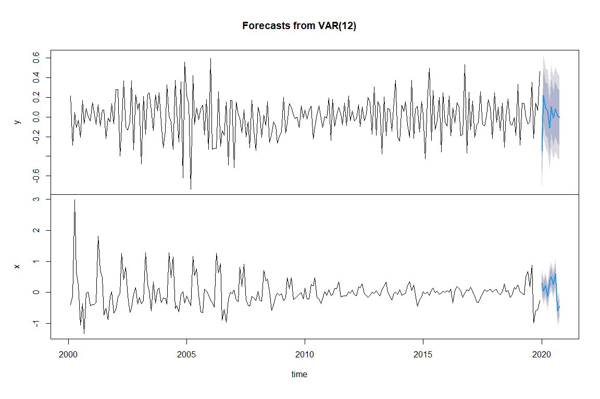<!-- -->

# Conclusions and Next Steps

The situation on the US-Mexico border is dynamic and complex. The number
of people who attempt to cross the border illegally in determined by a
number of social, political, and economic factors both in the US and in
the home country of the migrants. As the above analysis shows,
univariate time series analysis, using both statistical and machine
learning approaches are not able to adequately anticipate large,
previously unseen swings in the number of encounters. We see this first
in January 2017. Immediately follow President Trump’s inauguration,
border encounters declined significantly. This may have been a result of
political rhetoric at the time or some other indeterminate factor.
Similarly, the models were unable to accurately account for a
significant upswing in encounters in the middle of 2019. While it is not
completely clear, this increase may have been a result of changes to the
US immigration policies.

None of this is particularly surprising given that time series modeling
and forecasting relies heavily on the relationship between on period and
the periods that came before. Seasonality and trends are somewhat
predictable. Large changes resulting from external factors are not.

Multivariate analysis provides another approach whereby data from other
time series can be incorporated into the modeling. This analysis
illustrated a possible approach to the by examining US Gross Domestic
Product, US Housing Starts, and US Unemployment. Preliminary analysis
suggests that there is a moderately strong correlation between housing
starts and border encounters. This makes a certain amount of sense if
migrants are crossing into the US in search of employment, in
particular, in the construction trades.

Using a vector autoregression approach, border encounters and housing
starts were modeling together as endogenous variables. The Granger
causality metric was used to evaluate whether one series statistically
“caused” the other. Primarily used in econometrics, a time series *X* is
said to Granger-cause *Y* if it can be shown, usually through a series
of statistical tests on lagged values of *X* (and with lagged values of
*Y* also included), that those *X* values provide statistically
significant information about future values of *Y*. The null hypothesis
is that there is no Granger causality. For the two series modeled, the
p-value for testing whether housing starts Granger-cause border
encounters was 0.13. This is below the typical threshold value of 0.05,
but is close enough that further testing and analysis could be
warranted.

Next steps for this analysis would be to continue with multivariate
analysis and examining other time series data as well as perhaps adding
categorical exogenous variable to represent factors such as Presidential
administration or particular immigration policy. In addition, further
work should be performed to apply deep learning techniques to the
multivariate analysis.

# References

Bali, R., D. Sarkar, B. Lantz, and C. Lesmeister. *R: Unleash Machine
Learning Techniques*. Learning Path. Packt Publishing, 2016.
<https://books.google.com/books?id=3ZfcDgAAQBAJ>.

“Explore Tidymodels - Search Parsnip Models.” Accessed February 19,
2021. <https://www.tidymodels.org/find/parsnip/>.

*Forecasting: Principles and Practice (3rd Ed)*. Accessed February 8,
2021. <https://Otexts.com/fpp3/>.

Gardner, Everette S. “Exponential Smoothing: The State of the Art—Part
II.” *International Journal of Forecasting* 22, no. 4 (October 2006):
637–66. <https://doi.org/10.1016/j.ijforecast.2006.03.005>.

Hyndman, Rob J., and Anne B. Koehler. “Another Look at Measures of
Forecast Accuracy.” *International Journal of Forecasting* 22, no. 4
(October 2006): 679–88.
<https://doi.org/10.1016/j.ijforecast.2006.03.001>.

Krispin, R. *Hands-On Time Series Analysis with R: Perform Time Series
Analysis and Forecasting Using R*. Packt Publishing, 2019.
<https://books.google.com/books?id=F9KytQEACAAJ>.

Prophet. “Prophet.” Accessed February 22, 2021.
<http://facebook.github.io/prophet/>.

“The Tidymodels Extension for Time Series Modeling.” Accessed February
19, 2021. <https://business-science.github.io/modeltime/index.html>.

Wei, W.W.S. *Multivariate Time Series Analysis and Applications*. Wiley
Series in Probability and Statistics. Wiley, 2019.
<https://books.google.com/books?id=9naCDwAAQBAJ>.
