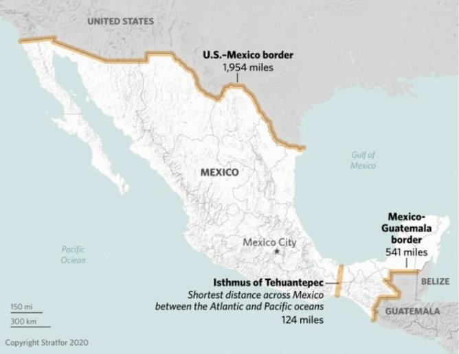
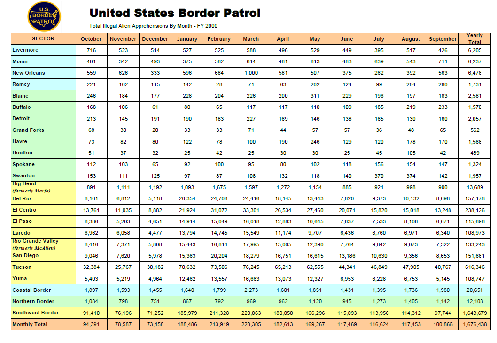

# Forecasting US Border Patrol Encounters Along the US-Mexico Border

# Introduction

The US-Mexico border is one of the longest and busiest in the world (Figure 1). According to the US Bureau of Transportation Statistics, in 2018, 500,000 people and \$1.7 billion worth of goods crossed the nearly 2,000-mile border every day. Mexico is the United States' third-biggest trading partner behind Canada and China; US consumers and manufacturers are also heavily reliant upon the dozens of road and rail networks that connect the two countries along the border. Consumers and manufacturers are thus concerned when surges of migrants from Central America causes disruptions to the movement of people and goods across the US-Mexico border.



The US Border Patrol has a seemingly straightforward mission: Secure the US borders between ports of entry. However, th length and diversity of the Southwest border, in particular, makes this a difficult if not impossible task. In addition, the nature of immigration along the southern US border has changed over the course of the last 20 years. According the Stratfor (2021), in 2000, Mexican nationals accounted for 98% of apprehensions along the US-Mexico border. Since 2000, encounters with Mexican nationals have been declining, while encounters with nationals from Guatemala, Honduras and El Salvador have been increasing. The reasons for these increases, referred to as push and pull factors, are diverse. According to Stratfor, "poverty, crime, and corruption already provided Guatemalans, Hondurans, and Salvadorans plenty of incentives to emigrate before 2020, as evidenced by the years-long upward trend in apprehensions of Northern Triangle nationals along the US-Mexico border" (2021). Add to that the economic impact of the COVID-19 pandemic, back-to-back major hurricanes in November of 2020, and worsening living conditions in the Northern Triangle, especially for the poorer, marginalized segments of society. Whatever the reasons, the problems at the Southwest border will not soon subside due to changes in immigration policy or the construction of a border wall. Unfortunately, the US Border Patrol constantly finds itself in a reactive posture, attempting to adjust resources and deployments based on what has already happened.

```{r setup, include=FALSE}
knitr::opts_chunk$set(echo = TRUE)
knitr::opts_chunk$set(fig.width=12, fig.height=8) 
```

## Libraries Used

```{r, message = FALSE, warning = FALSE}
library(tidymodels)
library(modeltime)
library(tidyverse)
library(timetk)
library(lubridate)
library(dplyr)
library(readr)
library(fable)
library(tsibble)
library(yardstick)
library(reshape2)
library(knitr)
library(readxl)
library(TSstudio)
library(forecast)
library(vars)
library(dynlm)
library(ggplot2)
library(tseries)
library(MTS)
library(stargazer)
```

## Data

US Customs and Border Protection (CBP), the parent agency of the Border Patrol, reports its historical data on a monthly basis (Figure 2). This data is made available on the CBP web site in the form of a pdf file (Figure 3). The currently available report covers the period of 2000 through 2019. Processing this data will present a bit of a challenge as it will need to be scraped from the pdf, reformatted, and cleaned. In addition, other sources of relevant data will be explored. For example, the Federal Reserve Economic Date (FRED) site provided by the Federal Reserve Bank of St. Louis, makes available a large number of economic data for many countries. This data will be incorporated into the analysis as appropriate.




The data for this analysis was scraped from the PDF using the tabulizer library. There were a number of slight difference between the years, so the data also required several cleaning and reformatting steps before it could be used. These included:

-   Dropping unused columns and rows

-   Transposing the data frame

-   Renaming several of the columns

-   Adding the year and month to each data frame

-   Combining all of the data frames

-   Converting the character date information to a date field

-   Removing commas from the numeric fields

Since this process only needed to be completed one time, the cleaned and reformatted data was saved to the Github repository.

```{r message = FALSE, warning = FALSE, include=FALSE}
# 1.0 LOAD DATA FROM REPO ----

urlfile="https://raw.githubusercontent.com/deltick/MSDS692b/main/Data/USBPTS.csv"
TestV1<-read_csv(url(urlfile))
t1 <- dplyr::select(TestV1, xDate, "Southwest Border")
t1 <- dplyr::rename(t1, date=xDate)
t1 <- dplyr::rename(t1, value="Southwest Border")
data_prepared_tbl <- t1

```

# Exploratory Data Analysis

The first step in the EDA was to examine the first and last rows of the combined data frame to check for consistency and errors.

A plot of the time series shows wide variations and seasonal swings in the early years followed by a relatively flat period, followed by a severe spike. The decomposition shows a downward trend followed by a relatively flat period, followed by a slight increase. The is clearly a seasonal component, however the amplitude of the seasonal swings decreases over time. Finally, the noise component appears to be relatively random with the exception of a couple spikes that correspond to irregular periods in the series. The ADF test, indicates that we cannot reject the null hypothesis that the series is stationary. Therefore, no transformations were performed on the data. In addition, an ARIMA model (using auto.arima) fit an ARIMA(1,0,2)(2,1,0)[12] model. Since the non-seasonal differencing is 0, this confirms the ADF test results.

The autocorrelation and partial autocorrelation plots show significant correlation with lagged values.

```{r}
kable(head(t1))
kable(tail(t1))

```

```{r}
swb.ts <- ts(t1$value, start=c(2000, 01), frequency=12)
autoplot(swb.ts)
```

```{r}
summary(swb.ts)
hist(swb.ts)
boxplot(swb.ts)

```

```{r}
components <- decompose(swb.ts)
plot(components)

```

```{r}
adf.test(swb.ts)
```

```{r}

acf(ts(((swb.ts))),main='ACF SW Border Encounters')
pacf(ts(((swb.ts))),main='PACF SW Border Encounters')
```

The data was also split into training and testing sets. The last 12 months of data are used for testing and accuracy purposes. The split is seen in the chart below.

```{r message = FALSE, warning = FALSE, include = FALSE }
# * Train/Test ----
splits <- time_series_split(data_prepared_tbl, assess = "1 year", cumulative = TRUE)

splits %>%
    tk_time_series_cv_plan() %>%
    plot_time_series_cv_plan(date, value) 

```

# Modeling Univariate Time Series

There are a wide range of options available to model a univariate time series. There are traditional, statistically-based approaches such as ARIMA and ETS. In addition, there a number machine learning and deep learning routines that and be used as well. There are also a number of packages in the R ecosystem that provide time series models as well as utilities for plotting, forecasting and accuracy analysis.

One of the more recent tools is Facebook's open source project Prophet. Prophet "is a procedure for forecasting time series data based on an additive model where non-linear trends are fit with yearly, weekly, and daily seasonality, plus holiday effects. It works best with time series that have strong seasonal effects and several seasons of historical data. Prophet is robust to missing data and shifts in the trend, and typically handles outliers well.

One of the biggest challenges with using different time series and forecasting packages is that there are several formats for time series object (e.g., ts, xts, tsibble). Different packages often require a different data format and therefore the time series must be converted or recreated. Instead of incorporating multiple packages, I decided to use a "tidymodels" approach. Using the tidymodels and parsnip packages I was able to use a common interface for multiple forecast models. WIth this approach, I was able to easily create to following models:

-   ARIMA (using auto.arima

-   Linear Regression (with no trend)

-   Facebook Prophet

-   Random Forest

-   Extreme Gradient Boost (xgboost)

-   Support Vector Machine (with polynomial kernel)

-   Prophet with XGBoost

-   ARIMA with XGBoost

-   Neural Network ARIMA (feed-forward neural networks with a single hidden layer and lagged inputs

-   Exponential Smoothing (M,N,M)

```{r message = FALSE, warning = FALSE}

# * ARIMA ----
model_fit_arima <- arima_reg() %>%
    set_engine("auto_arima") %>%
    fit(
        value ~ date, 
        data = training(splits)
    )

# * LINEAR REGRESSION ----
model_fit_lm <- linear_reg() %>%
    set_engine("lm") %>%
    fit(
        value ~ as.numeric(date) + month(date, label = TRUE), 
        data = training(splits)
    )

# * LINEAR REGRESSION - NO TREND ----
model_fit_lm_no_trend <- linear_reg() %>%
    set_engine("lm") %>%
    fit(
        value ~ month(date, label = TRUE), 
        data = training(splits)
    )

# * PROPHET ----
model_fit_prophet <- prophet_reg() %>%
    set_engine("prophet") %>%
    fit(
        value ~ date, 
        data = training(splits)
    )

# * RANDOM FOREST ----
model_fit_rf <- rand_forest(mode = "regression") %>%
    set_engine("randomForest") %>%
    fit(
        value ~ as.numeric(date) + month(date, label = TRUE), 
        data = training(splits)
    )

# * XGBOOST ----
model_fit_xgboost <- boost_tree(mode = "regression") %>%
    set_engine("xgboost") %>%
    fit(
        value ~ as.numeric(date) + month(date, label = TRUE), 
        data = training(splits)
    )

# * SVM - Polynomial ----
model_fit_svm_poly <- svm_poly(mode = "regression") %>%
    set_engine("kernlab") %>%
    fit(
        value ~ as.numeric(date) + month(date, label = TRUE), 
        data = training(splits)
    )

# * SVM - RBF ----
model_fit_svm_rbf <- svm_rbf(mode = "regression") %>%
    set_engine("kernlab") %>%
    fit(
        value ~ as.numeric(date) + month(date, label = TRUE), 
        data = training(splits)
    )

# * PROPHET BOOST ----
model_fit_prophet_boost <- prophet_boost() %>%
    set_engine("prophet_xgboost") %>%
    fit(
        value ~ date + as.numeric(date) + month(date, label = TRUE), 
        data = training(splits)
    )

# * ARIMA BOOST ----
model_fit_arima_boost <- arima_boost() %>%
    set_engine("auto_arima_xgboost") %>%
    fit(
        value ~ date + as.numeric(date) + month(date, label = TRUE), 
        data = training(splits)
    )

model_fit_nn <- nnetar_reg() %>%
    set_engine(engine = "nnetar") %>%
    fit((value) ~ date, data = training(splits))

model_fit_ets <- exp_smoothing(
        seasonal_period  = 12,
        error            = "multiplicative",
        trend            = "none",
        season           = "multiplicative"
    ) %>%
    set_engine("ets") %>%
    fit((value) ~ date, data = training(splits))

```

In addition to tidyverse and parsnip, I also used Modeltime, a library that extends tidymodels specifically for time series analysis and forecasting. For example, Modeltime provides a data structure that can be used to hold the results of the models created above. This data structure is then used to support forecasting and accuracy analysis.

```{r}
# * Modeltime Table ----
model_tbl <- modeltime_table(
    model_fit_arima,
    model_fit_lm_no_trend,
    model_fit_prophet,
    model_fit_rf,
    model_fit_xgboost,
    model_fit_svm_poly,
    model_fit_prophet_boost,
    model_fit_arima_boost,
    model_fit_nn,
    model_fit_ets
)

```

## Calibration and Plotting Against the Test Data

The Modeltime calibration process was used to model the test data set and generate accuracy metrics. The following metrics were generated for each of the models.

-   MAE: Mean absolute error

-   RMSE: Root mean squared error

-   MAPE: Mean absolute percentage error

-   MASE: Mean absolute scaled error

-   RSQ: R squared coefficient of determination

From the results in the table below we can see that the linear model and the Prophet XGBoost models have the best combination of accuracy scores.

```{r}
# * Calibrate ----
calibration_tbl <- model_tbl %>%
    modeltime_calibrate(testing(splits))

calibration_tbl %>%
    modeltime_accuracy(metric_set = metric_set(mae, rmse, mape, mase,  rsq)) %>%
    table_modeltime_accuracy(.interactive = FALSE)

calibration_tbl %>%
    modeltime_forecast(
        new_data = testing(splits), 
        actual_data = data_prepared_tbl,
        conf_interval = 0.80
    ) %>%
    plot_modeltime_forecast(.legend_show = TRUE, 
                            .legend_max_width = 25,
                            .interactive=FALSE)
```

## Generating the Forward-Looking Forecasts

The true test of a time series model is how will it predicts future periods. Using Modeltime routines we were able to refit and forecast data for the 12 months following the dates of our time series. The results are plotted below.

```{r message = FALSE, warning = FALSE}
# * Refit ----
refit_tbl <- calibration_tbl %>%
    modeltime_refit(data = data_prepared_tbl) 

forecast_tbl <- refit_tbl %>%
    modeltime_forecast(
        h = "1 year",
        actual_data = data_prepared_tbl,
        conf_interval = 0.95
    ) 

forecast_tbl %>%
    plot_modeltime_forecast(.interactive = FALSE)


```

## Creating and Visualizing a Composite Forecast

The final step in forecasting is to generate a composite forecast. In this case we average the results of the individual models to create a mean forecast. The results of this forecast as shown below.

```{r message = FALSE, warning = FALSE}

# 4.0 MODEL AVERAGING ----

# * Mean Forecast ----
mean_forecast_tbl <- forecast_tbl %>%
    filter(.key != "actual") %>%
    group_by(.key, .index) %>%
    summarise(across(.value:.conf_hi, mean)) %>%
    mutate(
        .model_id   = 12,
        .model_desc = "AVERAGE OF MODELS"
    )

# * Visualize Mean Forecast ----
forecast_tbl %>%
    filter(.key == "actual") %>%
    bind_rows(mean_forecast_tbl) %>%
    plot_modeltime_forecast(.interactive = FALSE)

```

# Accuracy Versus 2020 Actual Results

Given the models and the forecasts, we next examine the results compared to the actual results for the year 2020. These are published on the USBP web site but not yet incorporated into the yearly PDF report. Therefore, these numbers were not including in the modeling but are used to compare the forecasts from the models with the reality of what actually occurred during the forecast period.

After some data wrangling, we are able to see the 2020 forecast plotted against the individual forecasts. It is interesting to note that none of the forecasts were able to accurately anticipate the drop in border encounters that occurred midway through 2020 as borders were closed to all but essential traffic due to the COVID-19 pandemic. In addition, USBP did not accept any claims of asylum during this period and returned any migrants using its Title 42 authorities, which allow the return of migrants for public health reasons.

The table of accuracy metrics is also provided and indicates that the ETS and Random Forrest models were relatively accurate.

```{r message = FALSE, warning = FALSE, include = FALSE }
## Compare Forecasts to Actual 2020 results

allPred <- forecast_tbl %>%
    dplyr::filter(.key == 'prediction') %>%
    dplyr::select(.model_desc, .index, .value)
    #dplyr::select(.model_id, .model_desc,.index, .value) 


Y20Actuals <- read_csv("C:/Users/JJT/Desktop/Y20Actuals.csv")
allValues <- rbind(allPred, Y20Actuals)
allValues.cast <- dcast(allValues, .index ~ .model_desc, mean)

actual.ts <- ts(allValues.cast$ACTUAL, start=c(2020, 1), frequency=12)
etsmnm.ts <- ts(allValues.cast$`ETS(M,N,M)`, start=c(2020, 1), frequency=12)
kernlab.ts <- ts(allValues.cast$KERNLAB, start=c(2020, 1), frequency=12)
lm.ts <- ts(allValues.cast$LM, start=c(2020, 1), frequency=12)
nnetar.ts <- ts(allValues.cast$`NNAR(1,1,10)[12]`, start=c(2020, 1), frequency=12)
prophet.ts <- ts(allValues.cast$PROPHET, start=c(2020, 1), frequency=12)
prophetxg.ts <- ts(allValues.cast$`PROPHET W/ XGBOOST ERRORS`, start=c(2020, 1), frequency=12)
randomforest.ts <- ts(allValues.cast$RANDOMFOREST, start=c(2020, 1), frequency=12)
arima1.ts <- ts(allValues.cast$`UPDATE: ARIMA(3,1,2)(2,1,1)[12] W/ XGBOOST ERRORS`, start=c(2020, 1), frequency=12)
arima2.ts <- ts(allValues.cast$`UPDATE: ARIMA(4,1,0)(2,1,1)[12]`, start=c(2020, 1), frequency=12)
xgboost.ts <- ts(allValues.cast$XGBOOST, start=c(2020, 1), frequency=12)

all2020Preds <- cbind(actual.ts,  etsmnm.ts, kernlab.ts, lm.ts, nnetar.ts, prophet.ts, prophetxg.ts, randomforest.ts, arima1.ts, arima2.ts, xgboost.ts)

```

```{r}

autoplot(all2020Preds) +
    ggtitle('Plot of Predicions vs 2020 Actuals')


```

```{r message = FALSE, warning = FALSE, include = FALSE}

## Created a yardstick metrics set to pull out the metrics of interest.
## Created a function to get the metrics from each model
## Extracted and formated results into metrics table

combined_metrics_set <- metric_set(mape, rmse, mase, mae, rsq)

get_combined_metrics <- function(est) {
    allMetrics <- combined_metrics_set(allValues.cast, ACTUAL, est )
    return(allMetrics)
}    
    
metrics_output <-  NULL
for (i in seq_along((allValues.cast))) {
    if (i > 1)
        metrics_output[[i]] <- get_combined_metrics(allValues.cast[[i]] )
}

metrics_output <- bind_rows(metrics_output)
metrics_output <- metrics_output %>% dplyr::select(-.estimator)
all_mape <- filter(metrics_output, .metric=='mape')
all_rmse <- filter(metrics_output, .metric=='rmse')
all_mase <- filter(metrics_output, .metric=='mase')
all_mae  <- filter(metrics_output, .metric=='mae')
all_rsq  <- filter(metrics_output, .metric=='rsq')

all_metrics <- cbind(all_mape, all_rmse, all_mase, all_mae, all_rsq)
names(all_metrics)[1] <- "mapen"
names(all_metrics)[2] <- "mape"
names(all_metrics)[3] <- "rmsen"
names(all_metrics)[4] <- "rmse"
names(all_metrics)[5] <- "masen"
names(all_metrics)[6] <- "mase"
names(all_metrics)[7] <- "maen"
names(all_metrics)[8] <- "mae"
names(all_metrics)[9] <- "rsqn"
names(all_metrics)[10] <- "rsq"

all_metrics.tib <- all_metrics %>% 
    dplyr::select(mape, rmse, mase, mae, rsq)

row.names(all_metrics.tib) <- c("Actual",  "ETS" , "Kernlab", "LM",
                                "NNetAR", "Prophet", "ProphetXG", "RandomForest", "Arima1",
                                "Arima2", "XGBoost")


```

```{r}

kable(round(all_metrics.tib, 2), type="text")

```

# Multivariate Time Series Analysis

It seems rather clear from a multivariate analysis of the USBP Southwest Border encounters that there are external factors impacting the time series. Immigration is a complex phenomenon that is influenced by social, political, and economic events that happen both in the migrant's home country (push factors) and those in the US (pull factors). This leads us to the next part of this analysis, that of multivariate time series analysis.

It is difficult to identify potential factors that can be quantified and it is equally difficult to find data sources that are recorded over the period of study and at the proper level of granularity (i.e., monthly). Rather than providing a specific answer to the question of which factors impact immigration, this analysis seeks rather to illustrate the process of incorporating external variables into a time series analysis.

Therefore, there are three additional economic series incorporated into the analysis. They are:

-   US Gross Domestic Product

-   US Housing Starts

-   US Unemployment

The data was acquired from the Federal Reserve Economic Data web site (fred.stlouisfed.org). These three particular data sets are recorded on a monthly basis and are available for dates that include the period of study. The data was downloaded from the web site and combined into an Excel spreadsheet. The the combined spreadsheet, I created three separate time series and then windowed them to include on same time period as the border encounters. The data was also scaled and centered and then combined into one ts object for plotting purposes.

```{r message = FALSE, warning = FALSE, include = FALSE }
## Read and format input files from Github repo

urlfile="https://raw.githubusercontent.com/deltick/MSDS692b/main/Data/USBPTS.csv"
inputTS<-read_csv(url(urlfile))
inputSel2 <- inputTS %>% dplyr::select("Southwest Border")
inputSel2 <- dplyr::rename(inputSel2, Value = "Southwest Border")
swb.ts <- ts(inputSel2, start=c(2000,1), frequency=12)

urlfile2="https://raw.githubusercontent.com/deltick/MSDS692b/main/Data/USMonthlyEconData.csv"
inputEcon <- read_csv(url(urlfile2))

## Create separate vectors for econ variables

gdp <- inputEcon %>% dplyr::select(USGDP)
housing <- inputEcon %>% dplyr::select(USHousingStarts)
unemp <- inputEcon %>% dplyr::select(USUnemployment)

## Create time series object and set matching windows

gdp.ts <- ts(gdp, start=c(1960, 1), frequency=12)
gdp.ts <- window(gdp.ts, start=c(2000, 1), end=c(2019,12))
forecast::autoplot(gdp.ts)+
  ggtitle('Plot of US Gross Domestic Product')

housing.ts <- ts(housing, start=c(1960, 1), frequency=12)
housing.ts <- window(housing.ts, start=c(2000, 1), end=c(2019,12))
forecast::autoplot(housing.ts)+
  ggtitle('Plot of US Housing Starts')

unemp.ts <- ts(unemp, start=c(1960, 1), frequency=12)
unemp.ts <- window(unemp.ts, start=c(2000, 1), end=c(2019,12))
forecast::autoplot(unemp.ts)+
  ggtitle('Plot of US Unemployment')

econ.ts <- cbind(gdp.ts, housing.ts, unemp.ts)
#forecast::autoplot(econ.ts)

## Center and scale all variables

swb.scaled.ts <- scale(swb.ts)
gdp.scaled.ts <- scale(gdp.ts)
housing.scaled.ts <- scale(housing.ts)
unemp.scaled.ts <- scale(unemp.ts)


```

There are some interesting observations that can be made from the combined plot of the scaled and centered data. For example, the spike in unemployment and the drop in GDP around 2009 seem to correspond to a decreasing trend in border encounters. In addition, the increase in housing starts appears to correspond to an increasing trend in border encounters.

```{r }
combined.ts <- cbind(swb.scaled.ts, gdp.scaled.ts, housing.scaled.ts, unemp.scaled.ts )
autoplot(combined.ts) +
  ggtitle('Plot of Scaled Series')
```

# Exploratory Data Analysis

For exploratory data analysis, we first look at the correlations among the different series. The most significantly correlated series with the SW Border encounters is US Housing Starts. This will be the focus of the analysis going forward.

The cross correlation plot housing starts with the border encounters again shows the correlation to specific lags indicating the housing starts may be both a leading and a lagging indicator. We also calculate the ADF statistic to examine stationarity. Finally, we determine the number of differences that might be used to make the series stationary.

```{r}
stargazer(cor(combined.ts), type="text")
```

```{r }
ccf(combined.ts[,1], combined.ts[,3],main="CCF Housing Starts")
## ADF Tests:  Null hypothesis--Not stationary.  p-value <0.5 reject Null

adf.test(combined.ts[,3])

ndiffs((combined.ts[,1]))
ndiffs((combined.ts[,3]))

```

As with the univariate series, the data is split into training and testing sets. For this analysis, the testing set contains the last two years of data.

```{r message = FALSE, warning = FALSE, include = FALSE}
## Split data set
swb.train <- window(swb.ts, end=c(2017,12))
swb.test  <- window(swb.ts, start=c(2018,1))
```

```{r}

x=combined.ts[,1]
y=combined.ts[,3]
ndiffs(x, test="kpss")
ndiffs(y, test="kpss")


```

```{r}
Granger <- cbind(y,x)
dGranger <- diff(Granger)

lag=VARselect(dGranger, lag.max=13)
lag$selection
```

## Multivariate Results

Using AIC as the lag selection metric, we us the VARS package to create a vector autoregression model. The results displayed below show the results for both models: one to predict x and one to predict y. For the y model it appears that the only significant lags are lags of y itself. The same is true for the x model, as well.

The portmanteau test is used to determine the presence of multivariate autocorrelation. From the results of the test the null hypothesis is rejected (p\<=0.05). That is, autocorrelations are not zero.

However, the Granger causality tests provide additional relevant information here. According the the Granger tests, neither series can be said to statistically "cause" the other at a p\<= 0.05. Threshold. However, the p-values for both tests are relatively close to 0.10. We might therefore be able to conclude that there is Granger causality if we relax the threshold value for p.

```{r}

lag12 <- vars::VAR(dGranger, p=12)
summary(lag12)

serial.test(lag12, type="PT.asymptotic")
## Reject null:  Residuals are not correlated

x2y <- causality(lag12, cause="x")
y2x <- causality(lag12, cause="y")

x2y$Granger
y2x$Granger


```

The last step is to use the vector autoregression model to product a forecast of future periods. The predict function provides a point forecast, in this case, for the next 24 months with confidence intervals of 0.95. Since the values are scaled and centered, we will need to "unscale" them for forecasting purposes.

```{r message = FALSE, warning = FALSE, include = FALSE}
predict(lag12, n.ahead=24, ci=0.95)


```

```{r}

plot(forecast(lag12))

```

# Conclusions and Next Steps

# References

Bali, R., D. Sarkar, B. Lantz, and C. Lesmeister. *R: Unleash Machine Learning Techniques*. Learning Path. Packt Publishing, 2016. <https://books.google.com/books?id=3ZfcDgAAQBAJ>.

"Explore Tidymodels - Search Parsnip Models." Accessed February 19, 2021. <https://www.tidymodels.org/find/parsnip/>.

*Forecasting: Principles and Practice (3rd Ed)*. Accessed February 8, 2021. <https://Otexts.com/fpp3/>.

Gardner, Everette S. "Exponential Smoothing: The State of the Art---Part II." *International Journal of Forecasting* 22, no. 4 (October 2006): 637--66. <https://doi.org/10.1016/j.ijforecast.2006.03.005>.

Hyndman, Rob J., and Anne B. Koehler. "Another Look at Measures of Forecast Accuracy." *International Journal of Forecasting* 22, no. 4 (October 2006): 679--88. <https://doi.org/10.1016/j.ijforecast.2006.03.001>.

Krispin, R. *Hands-On Time Series Analysis with R: Perform Time Series Analysis and Forecasting Using R*. Packt Publishing, 2019. <https://books.google.com/books?id=F9KytQEACAAJ>.

Prophet. "Prophet." Accessed February 22, 2021. <http://facebook.github.io/prophet/>.

"The Tidymodels Extension for Time Series Modeling." Accessed February 19, 2021. <https://business-science.github.io/modeltime/index.html>.

Wei, W.W.S. *Multivariate Time Series Analysis and Applications*. Wiley Series in Probability and Statistics. Wiley, 2019. <https://books.google.com/books?id=9naCDwAAQBAJ>.
